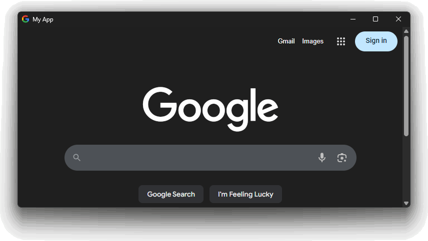

# Embedded Browser

Customizable, lightweight and 100% Java based desktop app with fancy GUI using classic web languages: HTML, CSS and JS.

[](https://www.oracle.com/java/technologies/javase/jdk17-archive-downloads.html)
[](https://mvnrepository.com/artifact/io.github.mrmiumo/embeddedbrowser)



## 🚀 Quick Start

Add the following dependency to your Maven POM:
```xml
<dependency>
    <groupId>io.github.mrmiumo</groupId>
    <artifactId>embeddedbrowser</artifactId>
    <version>2.0.0</version>
</dependency>
```
> 💡 **Gradle** and other build tools available on the [Maven repository](https://mvnrepository.com/artifact/io.github.mrmiumo/embeddedbrowser/1.0.6)!

<br>

Then, in you Java class, create a show a new window:
```java
// Creates and config the window with custom icon, title and size
InputStream icon = MyApp.class.getResourceAsStream("/logo.png");
EmbeddedBrowser browser = EmbeddedBrowser.create("main", true)
    .setTitle("My App")
    .setIcon(icon)
    .setMinSize(new Point(680, 320))
    .setSize(new Point(800, 400))
    .onExit(size -> {
        System.out.println("EmbeddedBrowser exit hook triggered: closing app...");
    });

// Displays the content of a custom URL
browser.setUrl("http://localhost:8080");

// Makes the window visible
browser.show();

// Close the window when no longer needed
browser.close();
```

## 📚 Documentation

Embedded Browser is based on `org.eclipse.swt.win32.win32.x86_64`. This lib enable to make usage of SWT easier by providing clear methods and abstracting the thread constraint. Each window has each own UI-thread which is required by SWT.

Complete by-method documentation is available directly from the JavaDoc.

## ⚠️ Limitations

Currently, **EmbeddedBrowser** only supports Windows OS. Technically, support for Linux and MacOS are totally doable but since I personally cannot test those by myself for now, those OS will not be available.